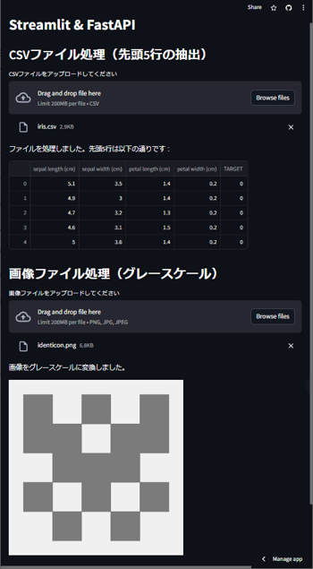

# 概要
StreamlitとFastAPIでCSVファイルと画像ファイルを扱う最小限のコードです。<br>
アプリURL: https://stream-it-fastapi.streamlit.app/

## StreamlitとFastAPIの機能の切り分けの考え方
・主な機能はFastAPIで実装しましょう。<br>
・FastAPIでは出来ないユーザーインターフェースの部分をStreamlitで実装しましょう。<br>
・今回の場合では、ファイルのアップロードや処理結果の表示をStreamlitで実装しています。<br>
※Streamlitで全て実装することも可能ですが、このようにを切り分けることでStreamlitの部分をNext.jsなどのモダンな環境で作成することが可能になります。

## 必要なライブラリ
<a href="https://github.com/okadajunji/streamlit-fastapi/blob/main/requirements.txt">`requirements.txt`</a>に記載しています。

以下のコマンドでインストールすることができます。

```
pip install -r requirements.txt
```

## ローカルでの実行コマンド
FastAPI
```
uvicorn main:app
```

Streamlit
```
streamlit run streamlit_app.py
```

# デプロイ

## FastAPI側をRenderへのデプロイ手順

①『New＋』をクリックします。<br>
②『Web Service』をクリックします。<br>


③『Next』をクリックします。<br>


④デプロイするリポジトリの『Connect』をクリックします。<br>


⑤『Name』に任意のアプリ名を入力します。デプロイ時のURLに利用されます。<br>
⑥『Start Command』に`uvicorn main:app --host 0.0.0.0 --port 10000`を入力します。<br>
<a style="color:orange;">※このコマンドによりFastAPI側のmain.pyが実行されます。</a>


⑦『Create Web Service』をクリックします。<br>


⑧アプリの起動を確認します。<br>
⑨『デプロイURL』をクリックします。<br>


`{"message":"Hello World"}`と表示されていれば成功です！<br>


これは以下の部分が対応しています。<br>
https://github.com/okadajunji/streamlit-fastapi/blob/9ef24efd0d4da2e109f28c3242a60732967e89b9/main.py#L10-L13

## Streamlit側をStreamlitShareへのデプロイ手順

①『New app』をクリックします。<br>


②デプロイするリポジトリをクリックします。<br>
③公開するアプリURLを設定します。<br>
④『Advanced settings...』をクリックします。<br>
⑤『Secrets』に以下の内容を入力します。<br>
　（`[your-app-name]`の部分は『FastAPI側をRenderへのデプロイ手順』の⑨を参照下さい）
```
RENDER_URL = "https://[your-app-name].onrender.com/"
```

これは以下の部分が対応しています。<br>
https://github.com/okadajunji/streamlit-fastapi/blob/4ad85f1200e0b3277f92a8776dc9a4f3d7dc5fb6/streamlit_app.py#L7-L10

⑥『Save』をクリックします。<br>
⑦『Deploy!』をクリックします。<br>


CSVファイルや画像ファイルをアップロードして動作すれば成功です！<br>


# 以上、おつかれさまでした！！