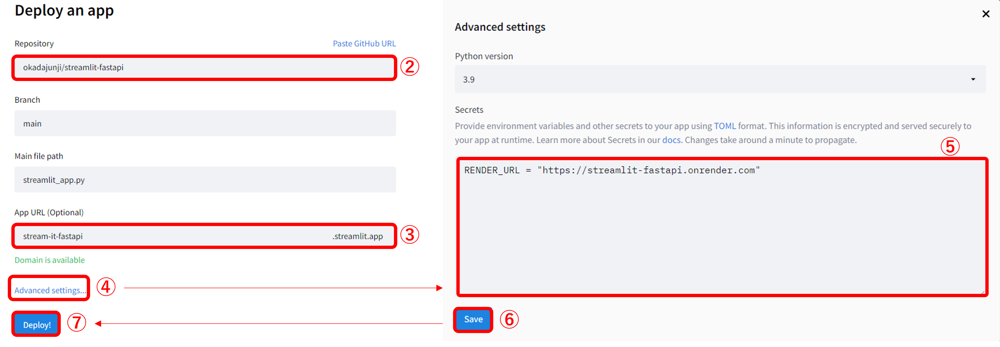

# 概要
StreamlitとFastAPIでCSVファイルと画像ファイルを扱う最小限のコードです。

## StreamlitとFastAPIの機能の切り分けの考え方
・主な機能はすべてFastAPIで実装し、FastAPIで出来ない部分をStreamlitで実装する。

・FastAPIで出来ない部分とは、ユーザーとのデータのやり取りの部分です。

・今回の場合では、ユーザーからのファイルの取得や処理結果の表示をStreamlitで実装しています。

## 必要なライブラリ
`requirements.txt`に記載しています。

以下のコマンドでインストールすることができます。

```
pip install -r requirements.txt
```

## ローカルでの実行コマンド
FastAPI
```
uvicorn main:app
```

Streamlit
```
streamlit run streamlit_app.py
```

# デプロイ

## FastAPI側をRenderへデプロイする

①『New＋』をクリック<br>
②『Web Service』をクリック<br>


③『Next』をクリック<br>


④デプロイするリポジトリの『Connect』をクリック<br>


⑤『Name』に任意のアプリ名を入力する（デプロイ時のURLに使われる）<br>
⑥『Start Command』に`uvicorn main:app --host 0.0.0.0 --port 10000`を入力する<br>
<a style="color:orange;">※このコマンドによりFastAPI側のmain.pyが実行される</a>


⑦『Create Web Service』をクリックする<br>


⑧アプリの起動を確認する<br>
⑨『デプロイURL』をクリックする<br>


`{"message":"Hello World"}`と表示されていれば成功！<br>


これは以下の部分が対応している。<br>
https://github.com/okadajunji/streamlit-fastapi/blob/9ef24efd0d4da2e109f28c3242a60732967e89b9/main.py#L10-L13

## Streamlit側をStreamlitShareへデプロイする

①『New app』をクリック<br>


②デプロイするリポジトリをクリック<br>
③公開するアプリURLを設定する<br>
④『Advanced settings...』をクリック<br>
⑤『Secrets』に以下の内容を入力<br>
　（`[your-app-name]`の部分は『FastAPI側をRenderへデプロイする』の⑨を参照）
```
[general]
RENDER_URL = "https://[your-app-name].onrender.com/"
```
⑥『Save』をクリック<br>
⑦『Deploy!』をクリック<br>


CSVファイルや画像ファイルをアップロードして動作すれば成功！<br>


# 以上、おつかれさまでした！！